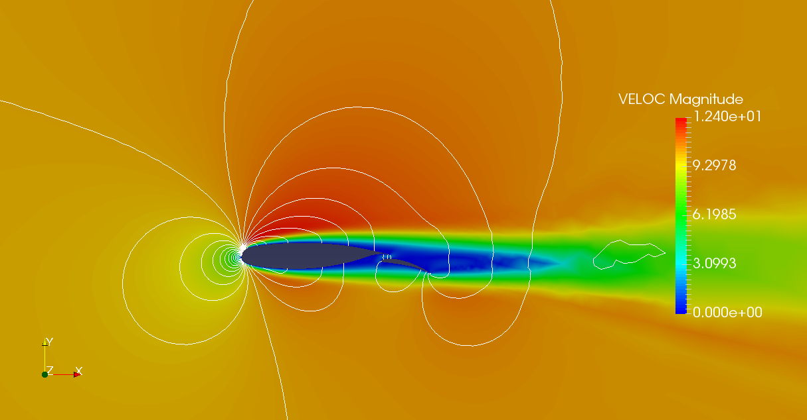
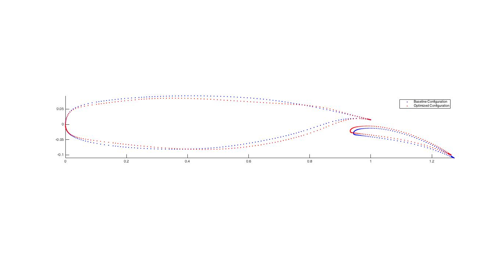

# Adjoint-BSC

Contains Fortran90 and Matlab codes written for Surface parameterization for Optimal Shape Design using HPC-based Adjoint Methods.

Velocity and Pressure data of optimised (Drag minimization, constant lift) multi element airfoil

Constrained Drag Minimization on Multi Element Airfoil NLR 2D 

Parameterized Onera M6 Wing